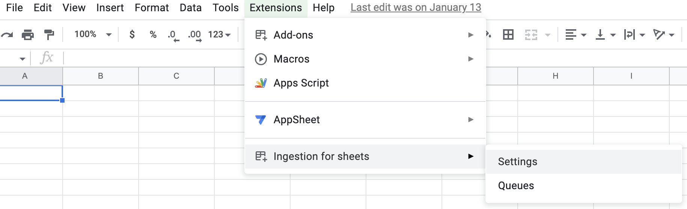
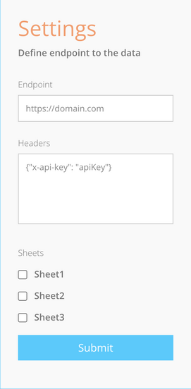
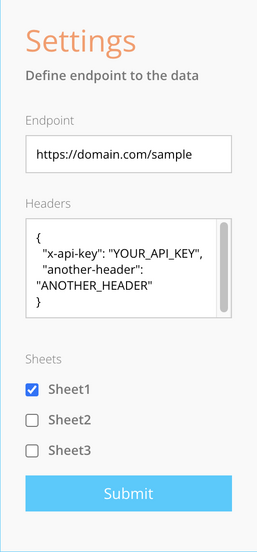

# Getting Started

This document will guide you through the process of installing the addon, and setting it up.

You can achieve that with a few simple steps:

## From sheets to endpoint in 4 steps

### 1. Install the addon on the document

### 2. Open the settings menu

The menu is at `Extensions > Ingestion for Sheets > Settings`

> 
> **Settings menu**

### 3. Configure the addon

> 
>
> **Settings sidebar**

As you can see, there are 3 fields that you need to fill in:

- **Endpoint** - This is the url that the addon will send the data to, you can use any url that accepts `POST` requests.
- **Headers** - This is a json object that will be sent as the headers of the request, you can use this to send authentication tokens, or any other headers that you need.
- **Sheets** - This should display all available sheets in the document, you can select which sheets you want to send to the endpoint.

At the end you should have something like this:

### 4. Submit the configuration

Once you're done, click the `Submit` button, and you're all set!

> 
>
> **Settings sidebar - example**

___

## What happens next?

Once you submit the configuration, the addon will start listening to changes in the selected sheets.
Those changes will be accumulated into a queue, and sent to the endpoint in batches every hour or
every time the queue reaches 100kb in size.

At the time you save a new configuration and every day after that
it'll pack all sheets into a single json object,
and send it to the endpoint to ensure that you have a full copy of the data.
This is done because some modifications don't fire events in google sheets,
as example, when you delete a row, the addon won't know about it,
when you cut data from a cell and paste it into another cell, the event
fired will only contain the new value, and not the old one.

Using the daily full sync, we can ensure that you have a full copy of the data,
because cells not sent in that payload can be considered empty, and even
modified cell will have the updated value.
