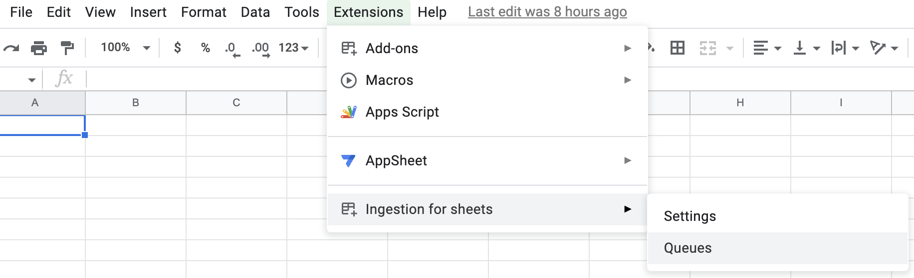
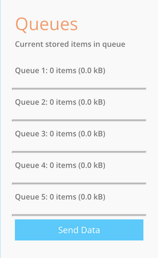
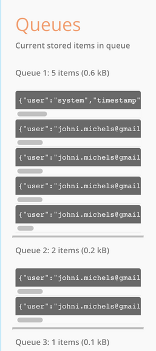

# Queue Management

Queues are a staging point where the data is accumulated before it's sent to the endpoint.
This is done to ensure that the data is sent in batches, and not one by one, which would be very inefficient.
Both it could cause the endpoint to be overloaded, and the addon to be throttled by google.

There are five queues on every document to ensure that there's no throttling.

There's only one thing that you need to know about the queue, and that's how to clear it.

## Clearing the queue

### Open the queues menu

The queues menu is at `Extensions > Ingestion for Sheets > Queues`

> 
> **Queues menu**

### Explore the sidebar

The sidebar will show you the queues, and the stored items in each queue.

>  
> 
> **Queues sidebar - Empty and filled with data respectively**

### Clear the queue

At the bottom of the sidebar, you'll see a button that says `Send Data`.

Hitting that button will force the addon to send the data in the queue to the endpoint.
This is useful if you want to send the data immediately, or if you want to clear the queue.
